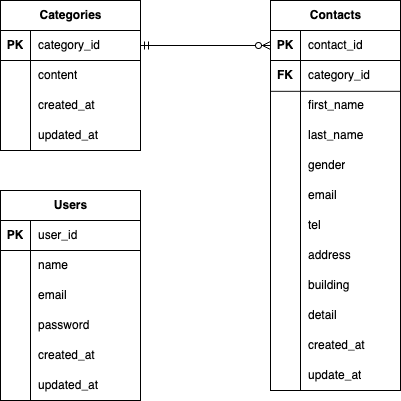

# Laravel Contact Form

Laravelで作成したお問合せフォームアプリです。
問い合わせ投稿、ユーザー登録・ログイン機能、管理画面での問い合わせ管理機能を備えています。

---

## 環境構築

### 1. リポジトリをクローン
```bash
git clone https://github.com/nae6/laravel-contact-form.git
cd laravel-contact-form
```

### 2. Dockerビルド
```bash
docker compose up -d --build
```

### 3. Laravel環境構築

#### 1. PHPコンテナに入る
```bash
docker compose exec php bash
```

#### 2. Laravelパッケージのインストール
```bash
composer install
```

#### 3. .env作成
```bash
cp .env.example .env
php artisan key:generate
```
.envを以下のように設定してください

```bash
APP_URL=http://localhost:8081

DB_CONNECTION=mysql
DB_HOST=mysql
DB_PORT=3306
DB_DATABASE=laravel_db
DB_USERNAME=laravel_user
DB_PASSWORD=laravel_pass
```

#### 4. データベース初期化
```bash
php artisan migrate
php artisan db:seed
```

---

## 開発環境
- お問合せ画面: http://localhost:8081
- ユーザー登録: http://localhost:8081/register
- ログイン: http://localhost:8081/login
- 管理画面: http://localhost:8081/admin
- phpMyAdmin: http://localhost:8080

---

## ログインユーザー・管理者について

このアプリに「管理者」専用の権限やロールはありません。`users`テーブルに登録された（＝会員登録した）ユーザーであれば誰でもログイン後に管理画面（`/admin`）へアクセスできます。

- あらかじめ用意されたシードユーザーはありません（`php artisan db:seed`では`categories`とお問い合わせデータのみ投入されます）。
- 管理画面を利用するには、以下の手順でユーザーを作成してください。

### 1. ユーザー登録
`http://localhost:8081/register` にアクセスし、お名前・メールアドレス・パスワードを入力して登録します。

### 2. ログイン
`http://localhost:8081/login` から、登録したメールアドレス・パスワードでログインします。

### 3. 管理画面へアクセス
ログイン後、`http://localhost:8081/admin` でお問い合わせ一覧の閲覧・検索・CSVエクスポート・削除が行えます。

---

## 使用技術
- PHP: 8.4.16
- Laravel: 8.83.29
- MySQL: 8.4.7
- nginx: 1.28.1
- DB: MySQL
- View: Blade
- Docker / docker-compose

---

## ER図

### テーブル構成
- users
- contacts
- categories

### リレーション
- categories (1) ─── (N) contacts



---

## 既知の制限事項

- 本リポジトリは学習用のポートフォリオ作品であり、実運用（本番デプロイ）は想定していません。
- Laravel 8系を使用しています。依存パッケージの脆弱性は `composer audit` で洗い出し、既存のバージョン制約内で修正可能なものは対応済みです（[fix/update-vulnerable-dependencies](https://github.com/nae6/laravel-contact-form/tree/fix/update-vulnerable-dependencies)）。
- フレームワーク本体（Laravel 8→10以降）のメジャーアップグレードが必要な項目が一部残っており、学習用リポジトリの範囲を超えるため対応を見送っています（EOLに伴う技術的負債として認識済み）。